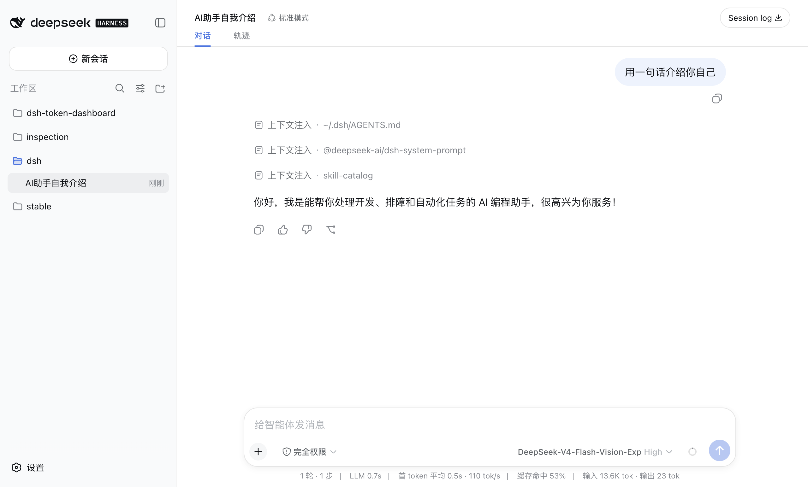

# dsh-gui

English | [中文](README.zh.md)

> Desktop shell for [dsh](https://github.com/deepseek-ai/deepseek-harness) (DeepSeek Harness): an Electron app delivered as a dsh bundle. Boot it with `dsh --profile gui` — it reuses the official dsh web client over an IPC fetch carrier instead of reimplementing harness features.

**Status: shell assembly, the first built-in feature module (token usage), and a standalone launcher .app.** `dsh --profile gui` launches Electron, loads the official web client over a custom protocol (`dsh-gui://`, no TCP port), and carries fetch over an IPC/unix-socket carrier. The packaged .app inverts the process tree: clicking the icon spawns the host itself, shows a splash while plugins load, and closing the window terminates the host. The "usage" entry at the bottom of the sidebar opens the token-consumption panel (today/week/30-day/all-time totals + a GitHub-style weekly heatmap + per-model top 3). `pnpm dev` still opens a placeholder window because boot graph and `apiProxy` only exist inside a live host.



## Token usage panel

The data pipeline matches the standalone [dsh-token-dashboard](https://github.com/apodemakeles/dsh-token-dashboard) plugin: the host watches session events, a dedicated worker thread owns the SQLite projection (`$DSH_HOME/data/token-dashboard/usage-v1.sqlite`), and the panel reads a single snapshot endpoint; `~/.dsh/sessions` stays the source of truth and the store is rebuildable at any time.

- **History carries over**: the same store file continues where the old plugin left off, and sessions created while no collector was running (CLI/gui-only usage) are back-filled from the session logs on the next boot.
- Maintenance CLI: `dsh-gui-token-usage status | verify | rebuild | backups | restore | cleanup` (writes require the exact name plus `--yes`).

## Install (target usage)

Requires dsh `0.1.x-rc`:

```sh
dsh plugin --profile gui add github:apodemakeles/dsh-gui
```

Then pick an entry point:

- **Launcher .app (recommended)**: download `dsh-gui-mac-arm64.app.zip` from the [releases](https://github.com/apodemakeles/dsh-gui/releases), unzip, and drag `dsh-gui.app` into `/Applications`. Clicking the icon boots the host (`dsh --profile gui`) as a child process, shows a splash while plugins load, and **closing the window terminates the host too**. The app is not signed: the first launch of a downloaded copy needs a one-time approval in System Settings → Privacy & Security. Functionality updates keep flowing through the plugin; the .app itself rarely changes.
- **Terminal**: `dsh --profile gui` — unchanged, useful for debugging (host logs stay on the terminal).

Because the shell ships Electron as a runtime dependency, pnpm will ask you to approve build scripts once: copy the printed package keys (`@apodemakeles/dsh-gui` and `electron`) into the `allowBuilds` list of your profile's `pnpm-workspace.yaml`, then re-run `add`.

## Development

- Node `>= 22.5` (`node:sqlite`), pnpm (the version is pinned via `packageManager`).

```sh
pnpm install        # also runs prepare → build (electron-vite + tsdown)
pnpm dev            # placeholder window (the real client needs `dsh --profile gui`)
pnpm typecheck      # tsc --noEmit
pnpm test           # vitest
pnpm build          # electron-vite build (out/) + tsdown (lib/)
pnpm package:mac    # local unpacked .app under release/ (arm64), via the isolated staging in scripts/package-mac.mjs
```

Distro facts in brief: single installable package (`dsh.bundle.patch` in `package.json`), plugin output in `lib/` built at install time via `prepare`, shell output in `out/`. Agent-facing conventions live in [AGENTS.md](AGENTS.md) (Chinese); the domain glossary lives in [CONTEXT.md](CONTEXT.md).

## Contributing

See [CONTRIBUTING.md](CONTRIBUTING.md). In short: short-lived branches + squash-merge PRs, conventional-commit prefixes (`feat:` / `fix:` / `chore:` / `docs:`).

## License

[MIT](LICENSE) © 2026 apodemakeles
